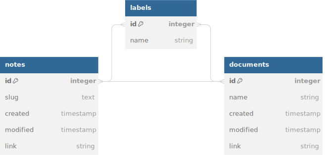

# Demo
https://main.d3vrje1l0nc6s.amplifyapp.com/
# Overview

## Problem
My digital documents are spread across a variety of cloud platforms because no single system provides the functionality I need. It is often difficult to:
- find documents that are related to each other because they are not co-located
- find specific documents because they are not searchable
- get information about what a document relates to without opening it up

## Goal
Create a cloud-native document management system (DMS) that combines features of Evernote and Google Drive.

# Context
## Current state of the art
Platforms like Evernote favour textual data, which lends itself well to  search. Finding things quickly is easy. The interface is centered around 'notes'. You can attach files to a note but there is no view where you can, for example, list all the files associated with a particular note or vice versa. The files are secondary to the notes and do not have their own metadata.

On the other hand, platforms like Google Drive or Dropbox have an interface centered around 'files', which is the same model as the typical hierarchical file systems we are used to. Related files are logically grouped into folders rather than notes. Files have limited metadata hence search is limited.

# Design

## Definitions
A "document" is human-readable unstructured data of some kind - image/audio/video files, PDF, Powerpoint, spreadsheet, etc.

A "note" is a piece of text that can link to a document.

## Features
Core features. The user can:
- create notes
- upload documents
- link notes to documents
- see what documents are associated with a note and vice versa
- add labels to notes and documents
- search note text
- search note and document metadata

## User Interface

Wireframes to come.

## Architecture

### Back End

Using a cloud-native approach offers the possibility of deploying a serverless back end. This is attractive for a few reasons - firstly, the promise of faster development without the need to provision and maintain server instances, and secondly, the ability to scale to zero when demand drops. 

I chose AWS because that is the cloud provider I am most familiar with. AWS provides a serverless compute resource (Lambda) as well as serverless databases (Aurora, DynamoDB).

Other services will be required to piece together the entire back end infrastructure:
- Cognito for user authentication and authorization
- S3 for file storage
- IAM to enable client access to AWS services
- API Gateway to handle API requests
- OpenSearch for full text search
- CloudFormation to provision resources
### Front End

- React for a responsive, native-like UI experience
- Tailwind CSS. I have experimented with different approaches to styling including styled components, and I prefer utility classes for ease of development and maintainability
- Vite for the build toolchain
- AWS Amplify provides a high-level, opinionated framework for building web/mobile applications on a AWS back end. The other option would be to use the AWS SDK but Amplify abstracts away many of the rote tasks of provisioning
### Data Model

Originally I had planned to use DynamoDB but it proved difficult to design the data model in a way that would faciliate the most common access patterns. For example, a simple access pattern involved retrieving a list of all notes sorted in order of their timestamps. Because DynamoDB partitions data (using a hash of the primary key), the only way to globally sort on a collection of items is to put all of the items inside the same partition. This would have worked but would have defeated the recommended design pattern which is optimized for performance.

Further, the entity relationship diagram shows there are multiple many-to-many relationships between notes, documents, and labels. Modeling this in DynamoDB involved a significant amount of denormalization and duplication. Denormalization is actually a recognized design pattern for NoSQL databases that helps to speed up reads by having related data in one place, but the complexity of trying to model multiple many-to-many relationships lead me to the conclusion that DynamoDB was not the right tool in this case.

Aurora is a relational database and therefore the many-to-many relationships can easily be captured using junction tables. In modeling relationships this way, we trade simplicity and speed at write time for more complexity at read time, since the data has to be joined from the entity tables. NoSQL databases make the opposite compromise, where capturing a many-to-many relationship involves writing data in multiple places but reading is ideally fast since the relationship is embedded inside the entity. Thus another consideration in abandoning DynamoDB as a design choice was cost: writing to DynamoDB is an order of magnitude more expensive than reading (in real dollar terms) and tracking all of these relationships was going to involve many write operations.